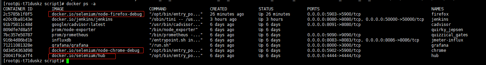
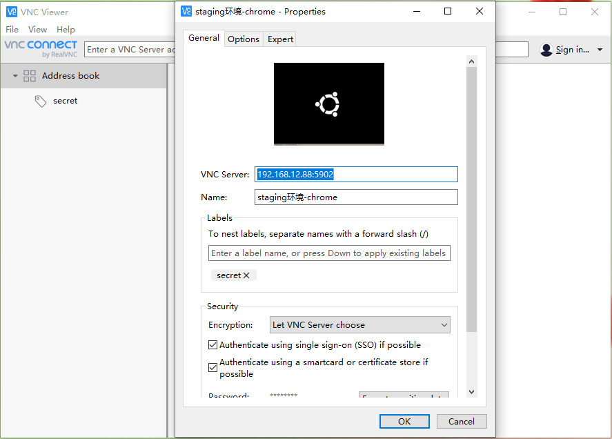
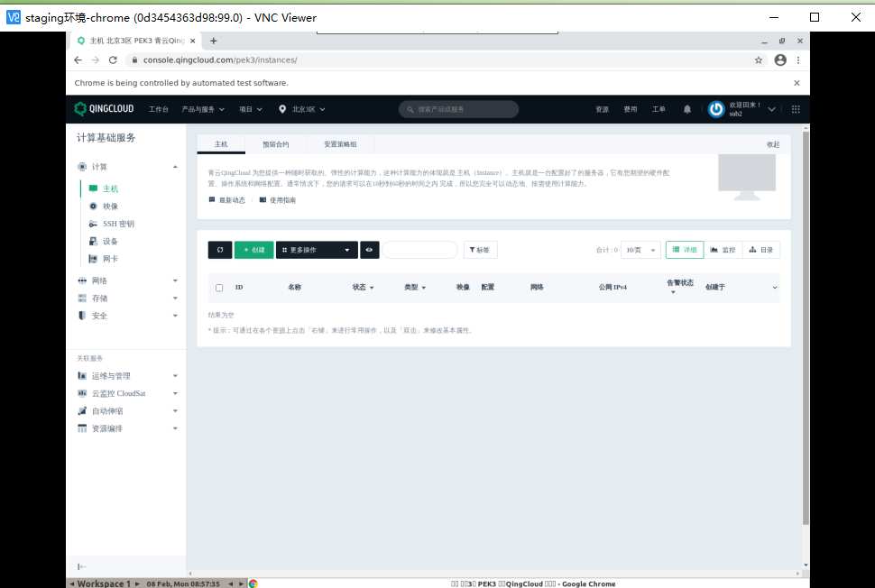

Console3.0 Selenium UI自动化测试框架
---------------------------------------------------------------------------------------------------------------------
#### 1.主要目录介绍
```text
    * common  
        basepage.py 基于selenium（webdriver）进行了二次封装  
        driver.py  浏览器带启动参数  
    * conf 存放项目的配置文件和元素的配置文件  
        * page_ele 
            page_ele.ini 元素的对象仓库  
        global_variable.py 全局变量相关的方法  
        settings.py 此项目的配置文件  
    * data 存放测试数据的目录  
    * drivers 存放各浏览器驱动的目录  
        * chrome  
            chromedriver.exe 谷歌浏览器驱动  
        * edge  
            msedgedriver.exe Microsoft Edge浏览器驱动    
        * firefox  
            geckodriver.exe 火狐浏览器驱动  
        * ie  
            IEDriverServer.exe IE浏览器驱动  
        * opera  
            operadriver.exe 欧鹏浏览器驱动  
    * file 存放上载文件、下载文件、项目图片的目录  
        * download 下载文件夹  
        * pic 项目引用的图片文件夹  
        * upload 上载文件夹  
        * user_data 用户文件夹  
    * log 日志存放路径_自动生成  
    * page_action  场景的组合  
    * page_locators 页面元素对象  
    * report 存放测试报告目录_自动生成  
        * pytest-report pytest-html生成的测试报告  
        * allure-report allure生成的测试报告  
    * results 存放allure的数据结果  
    * script 存放测试脚本的目录  
    * tools bat命令行工具
    * util 自定义的工具类  
        clip_board_util.py 封装了剪切板功能  
        date_util.py 封装了日期和时间处理模块  
        driver_util.py 封装了自动下载浏览器驱动的功能  
        file_util.py 封装了文件处理模块  
        HTMLTestRunner_CN.py unittest测试报告模块(中文)  
        HTMLTestRunner_CN.py unittest测试报告模块(英文)  
        key_board_util.py 封装了快捷键操作功能  
        logger.py 封装了日志处理模块  
        parse_configuration_file.py 封装了解析配置文件的功能  
        parse_excel.py 封装了读取和写入excel的功能  
        producedata.py 封装了生成随机数据的功能
        tools.py 工具类
        upload_file.py 封装了谷歌浏览器和火狐浏览器的win窗口操作功能
        xml_util.py 封装了xml解析功能
        yaml_util.py 封装了yaml文件读取功能
    * README.md 项目描述文件  
    * requirements.txt 项目需要安装的库文件 
    * run.py 测试项目运行的入口文件,封装了pytest运行命令;实现所有测试用例共用一个driver;实现了运行参数化
```

#### 2.驱动下载地址介绍
```text
    geckodriver(Firefox):https://github.com/mozilla/geckodriver/releases
    
    Chromedriver(Chrome):http://chromedriver.storage.googleapis.com/index.html
    
    IEDriverServer(IE):http://selenium-release.storage.googleapis.com/index.html
    
    operadriver(Opera):https://github.com/operasoftware/operachromiumdriver/releases
    
    MicrosoftWebDriver(Edge):https://developer.microsoft.com/en-us/microsoft-edge/tools/webdriver
```

#### 3.定位方式介绍

```text
self.getText("id=>kw")  #id
self.getText("class=>s_ipt")  #class定位
self.getText("name=>wd")  #name
self.getText("link_text=>新闻") #link text (点击百度首页上的"新闻"链接。)
self.getText("xpath=>//*[@class='s_ipt']")  #xpath
self.getText("xpath=>//*[@id='kw']")        #xpath
self.getText("css=>.s_ipt")     #css
self.getText("css=>#su")        #css

css 定位部分语法注解：
    范例：http://www.w3school.com.cn/cssref/css_selectors.asp
    注：在浏览器中用$('')的方式可检测css定位元素是否正确，例如:$('[id="kw"]')
    例如：
    $('[id="kw"]')   元素单个属性css定位
    $('[id="kw"][name="wd"]')  元素多个属性css定位
    $('#form>span:nth-child(2)')  form标签下 span:nth-child(n)，指明span是父元素的第几个孩子，>定位子元素，空格定位孙子元素
    
    .intro                 :选择class="intro"的所有节点
    #firstname             :选择id="firstname"的所有节点
    [target]               :选择带有target属性的所有节点
    [target=blank]         :选择target="blank"的所有节点
    [title~=flower]        :title属性包含单词flower的所有节点
    a[src^="https"]        :选择其src属性值以https开头的所有a节点
    a[src$=".pdf"]         :选择其src属性以.pdf结尾的所有a节点
    a[src*="abc"]          :选择src属性中包含abc字串的所有a节点
    #container .wrapper p  :选择id以container节点内部的wrapper节点内部的p节点
    
xpath定位注解:
    注：在浏览器中用$x('')的方式可检测xpath定位元素是否正确，例如:$x('//input[@id="kw"]')
    1.基本定位：
        使用id:
            例如-->//input[@id="kw"]，//为相对定位，/为绝对定位，/*代表所用元素中查找,例如:$x('//*[@id="kw"]')
        使用class:
            例如-->//input[@class="s_ipt"]
    2.相对路径和绝对路径:
        相对定位：以//开头
            例如-->//span//input[@name="wd"]
        绝对定位: 以/ 开头但是要从根目录开始，比较繁琐，一般不建议使用
            例如-->/html/body/div/a
    3.文本定位：
        text():根据元素的text内容【精确定位】
            例如-->百度页面中，//*[@id="u_sp"]//a[text()="视频"]
        contains(@属性/text().value):包含函数【模糊定位】
            例如-->百度页面中，//input[contains(@id,'kw')]
        starts-with：匹配以xx开头的属性值：
            例如-->百度页面中，//input[starts-with(@class,'s_ipt')]
        ends-with：匹配以xx结尾的属性值
            例如-->//input[ends-with(@class,"-special")]
    4.逻辑运算符：
        and 和 or 逻辑运算符定位
            例如-->//*[@id="kw" and @class="s_ipt"] 和 //*[@id="kw" or @name="wd"]
    5.轴定位：
        ...
```

#### 4.运行环境
```text
测试用例运行环境：
在ConsoleUI的根目录,运行python run.py 
-e参数指定测试的环境,可选参数["testing","staging","preview","product"],默认product
-d参数指定测试的浏览器,可选参数["chrome","firefox","ie","edge","opera"],默认chrome
-a参数指定是在本地或者远程运行,可选参数["local","remote"],默认local

例如:python run.py -e product -d chrome -a remote,表示在生产环境使用远程容器内的chrome浏览器来运行测试用例，同理:
在testing环境运行命令python run.py -e testing -d chrome -a local
在staging环境运行命令python run.py -e staging -d firefox -a remote
在预发布环境运行命令python run.py -e preview  -d edge -a local
```

#### 5.allure测试报告
```text
allure报告中浏览器及python版本的环境
在run.py文件中，通过write_environment_properties()方法，可自动设置浏览器的版本、测试地址、python版本
并写入到./results/environment.properties文件中，打开allure报告会自动展示

方式1:
    allure serve results 打开测试报告，results为数据目录

方式2:
./result/ 目录下的测试数据生成HTML测试报告到 ./report 路径下，-–clean 选项目的是先清空测试报告目录，再生成新的测试报告
    allure generate ./results/ -o ./report/ --clean  
打开报告
    allure open -h 127.0.0.1 -p 8883 ./report/
```
参考截图：


#### 6.远程运行测试用例
```text
1.先部署docker服务,这里省略,可参考网上的教程
2.下载docker.io/selenium/hub、docker.io/selenium/node-chrome-debug、docker.io/selenium/node-firefox-debug 镜像到本地
命令：
    docker search selenium
    docker pull docker.io/selenium/hub
    docker pull docker.io/selenium/node-chrome-debug
    docker pull docker.io/selenium/node-firefox-debug
3.启动hub容器、chrome容器、firefox容器
命令：
    docker run --name=hub -p 4444:4444 --restart always -e GRID_TIMEOUT=0 -e GRID_THROW_ON_CAPABILITY_NOT_PRESENT=true -e GRID_NEW_SESSION_WAIT_TIMEOUT=-1 -e GRID_BROWSER_TIMEOUT=15000 -e GRID_TIMEOUT=30000 -e GRID_CLEAN_UP_CYCLE=30000 -d docker.io/selenium/hub 
    docker run --name=chrome -p 5902:5900 --restart always -e NODE_MAX_INSTANCES=6 -e NODE_MAX_SESSION=6 -e NODE_REGISTER_CYCLE=5000 -e DBUS_SESSION_BUS_ADDRESS=/dev/null -v /dev/shm:/dev/shm --link hub -d docker.io/selenium/node-chrome-debug
    docker run --name=firefox -p 5903:5900 --restart always -e NODE_MAX_INSTANCES=6 -e NODE_MAX_SESSION=6 -e NODE_REGISTER_CYCLE=5000 -e DBUS_SESSION_BUS_ADDRESS=/dev/null -v /dev/shm:/dev/shm --link hub -d docker.io/selenium/node-firefox-debug
4.监控远程测试用例的运行情况
    电脑端安装VNC Viewer软件后,点左上角File->New connection,在VNC Server中输入端口和名称,这里我的docker外网IP为:192.168.12.88,
    谷歌浏览器用的端口为:5902,火狐浏览器用的端口为:5903,输入：192.168.12.88:5902,点击OK进行连接
    连接时输入密码 secret 
    在conf/setting.py中的HUB_ADDRES变量设置远程的hub注册地址,例如：HUB_ADDRES = "http://192.168.12.88:4444/wd/hub"
    启动测试,输入命令运行后,即可查看到远程运行测试用例的执行情况：
    python run.py -e product -d chrome -a remote
```
参考截图:  
  
  
  
  

